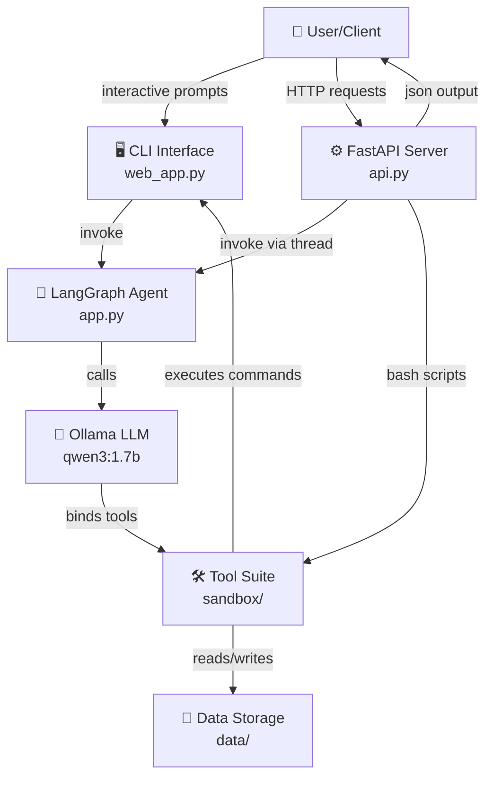
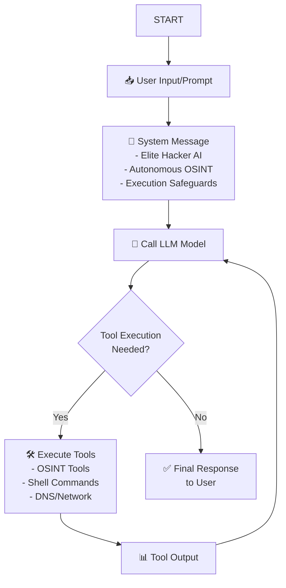
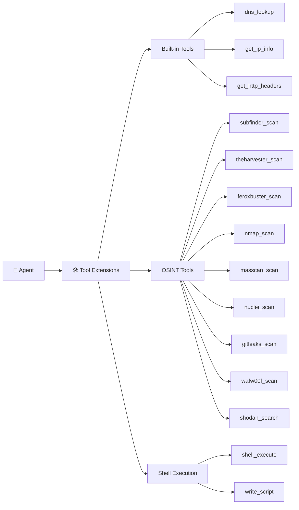
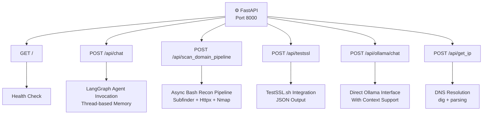
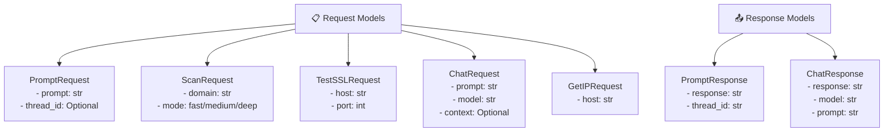

# 💀 CyberSec Hacker Agent

**An autonomous, elite white-hat cyber security expert and hacker AI powered by LangGraph and Ollama.**

This interactive CLI agent assists security professionals and researchers in deep reconnaissance, penetration testing, network scanning, threat intelligence, and custom scripting. It leverages local AI models (via Ollama) to ensure privacy while providing powerful autonomous capabilities.

---

## 🚀 Features

*   **Autonomous Reconnaissance:** Automatically selects and runs the right tools based on your target and objectives.
*   **Rich CLI Interface:** Includes a beautiful terminal UI with status spinners, markdown formatting, and color-coding powered by `rich`.
*   **Local AI (Privacy-First):** Uses Ollama models (e.g., `llama3.2`, `qwen2.5`) to process data locally. No cloud API keys required!
*   **Built-in OSINT Tools:**
    *   DNS Lookups & IP Geolocation
    *   HTTP Headers Fingerprinting
    *   Nmap (Port & Service Scanning)
    *   theHarvester (Emails & Subdomains)
    *   Masscan (Fast Port Scanning)
    *   Nuclei (Vulnerability Scanning)
    *   Gitleaks (Secrets Detection in Repos)
    *   Subfinder (Subdomain Enumeration)
    *   WafW00f (WAF Fingerprinting)
    *   Feroxbuster (Directory/Content Discovery)
    *   Shodan (Internet-facing device mapping)
*   **Arbitrary Shell Execution (with Safeguards!) 🛡️:** The agent can write and execute its own shell scripts or use tools not explicitly coded into the framework.
    *   **User Approval:** Like GitHub Copilot or VS Code agents, it will **prompt you for permission** before running any shell commands.
    *   **Hard-coded Guardrails:** Automatically blocks destructive commands (e.g., `rm -rf`, `mkfs`, `halt`).

---

## ♿ Accessibility

The agent is designed to be accessible to all users, including those using screen readers or those who require high-contrast plain text.

*   `--accessible`: Disables terminal animations, spinners, Markdown rendering panels, and colored ANSI text. This ensures compatibility with VoiceOver, NVDA, and JAWS.
*   `--tts`: Enables local Text-to-Speech (TTS). The agent will read its answers aloud, automatically stripping markdown syntax and emojis to ensure clear pronunciation.

```bash
uv run app.py --accessible --tts
```

---

1.  **Python 3.12+**
2.  **uv** (Python package manager, recommended)
3.  **Ollama** installed and running locally.
    *   Download from: [https://ollama.com/](https://ollama.com/)
    *   Pull a model that supports tool calling (e.g., `llama3.2`):
        ```bash
        ollama pull llama3.2
        ```
4.  **CLI Tools (Optional but highly recommended):**
    For the agent to use its extended toolset, ensure the following are installed and accessible in your system's `PATH`:
    *   `nmap`
    *   `masscan`
    *   `nuclei`
    *   `subfinder`
    *   `theHarvester`
    *   `gitleaks`
    *   `wafw00f`
    *   `feroxbuster`
    *   `shodan` (requires an API key configured via `shodan init <API_KEY>`)

---

## 📦 Installation

1. Clone the repository and navigate into the project directory:
   ```bash
   git clone <your-repo-url>
   cd cyb
   ```

2. Sync the dependencies using `uv` (or pip):
   ```bash
   # If you have uv installed:
   uv sync
   
   # Or manually:
   pip install -r requirements.txt
   ```

---

## 🕹️ Usage

1. Start the Ollama service in the background (if not already running):
   ```bash
   ollama serve
   ```

2. Run the agent:
   ```bash
   uv run app.py
   ```

3. Type your prompt into the CLI. For example:
   * *"Do a quick DNS and IP lookup on example.com"*
   * *"Scan scanme.nmap.org for open web ports and tell me what server they are running."*
   * *"Run subfinder on target.com and checking if any discovered subdomains are using a WAF."*
   * *"Write a python script to check if port 8080 is open on localhost and execute it."*

---

---

## 🏗️ Architecture

### System Architecture



### LangGraph Agent Workflow



### Tool Architecture



### API Endpoints Architecture



### Data Flow - Domain Scan

```mermaid
graph LR
    Domain["🎯 Domain Input"]
    Snap["Subdomain Enumeration<br/>subfinder + assetfinder"]
    DNS["DNS Resolution<br/>dnsx"]
    HTTP["HTTP Detection<br/>httpx"]
    Port["Port Scanning<br/>naabu + nmap"]
    Service["Service Detection<br/>nmap -sV"]
    URL["URL Collection<br/>gau + wayback"]
    Filter["Sensitive Endpoint<br/>Filtering"]
    Output["📊 Structured JSON<br/>Assets + Ports + Services"]
    
    Domain --> Snap
    Snap --> DNS
    DNS --> HTTP
    HTTP --> Port
    Port --> Service
    Service --> URL
    URL --> Filter
    Filter --> Output
```



### Request Model Architecture



### Directory Structure

```
cyb/
├── 📄 api.py                    # FastAPI Backend Server
├── 📄 app.py                    # LangGraph Agent Definition
├── 📄 web_app.py               # Streamlit Web Interface
├── 📄 requirements.txt          # Dependencies
├── 📄 pyproject.toml            # Project Config
├── 📁 sandbox/
│   ├── 📄 osint_tools.py        # OSINT Tool Definitions
│   └── 📄 tool_manager.py       # Tool Installation & Validation
├── 📁 data/
│   ├── recon-{domain}/          # Scan Results per Domain
│   │   ├── subs.txt             # Discovered Subdomains
│   │   ├── live.txt             # Live Hosts
│   │   ├── ports.txt            # Open Ports
│   │   ├── nmap.txt             # Service Detection
│   │   ├── hosts.txt            # Resolved IPs
│   │   └── action/              # Action-specific Data
│   └── ...
└── 📁 .venv/                    # Virtual Environment
```

---

## ⚠️ Disclaimer

This tool is intended for **authorized auditing and educational purposes only**. You must have explicit permission to scan, footprint, or test the targets you provide. Do not use this tool to attack infrastructure or networks you do not own or have written authorization to test.

*The author of this repository is not responsible for any misuse or damage caused by this software.*